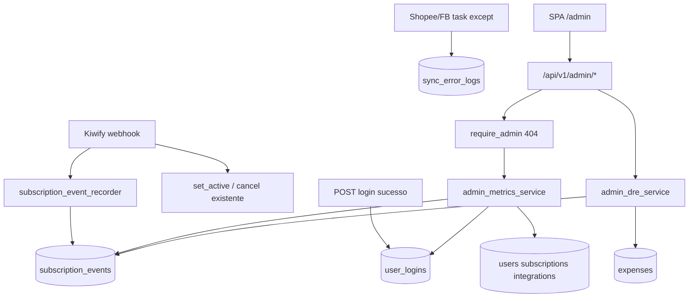

# Painel Admin MarketDash — Plano de Implementação

> Spec fonte: [`~/Downloads/painel_admin_marketdash.md`](/Users/joaoivson/Downloads/painel_admin_marketdash.md)  
> Ao executar: salvar também em `marketdash-frontend/docs/superpowers/plans/2026-07-22-painel-admin.md` e seguir por tasks com commits pequenos.

**Goal:** Painel `/admin` interno (MRR, faturamento, churn, clientes, uso, despesas, **DRE gerencial**) cruzando assinatura Kiwify com uso real do produto.

**Architecture:** Backend FastAPI (camadas routes → services → repositories) com `require_admin` em **todas** as rotas admin (404 se não-admin). Tabelas novas append-only / CRUD despesas. Frontend React isolado em `features/admin`, **sem** item no sidebar do app. Gravação de eventos no webhook Kiwify **antes** da lógica de acesso existente, sem mudar grant/revoke.

**Tech stack:** FastAPI + SQLAlchemy + PostgreSQL (Supabase) · React/Vite/Zustand/shadcn · Recharts (gráficos já usados no app)

## Global Constraints

- **NÃO MEXER:** OAuth/Meta, sync Shopee/Meta, pause/budget, ROAS/imposto/comissão, regra de liberação/corte do webhook Kiwify (só **ler** + append de histórico).
- **Acesso v1:** somente `relacionamento@marketdash.com.br` com `users.is_admin = true` (seed SQL). Outros e-mails não entram nesta release.
- **Segurança:** esconder menu ≠ segurança; endpoints admin sempre checam `is_admin`; FE `/admin/*` → 404 para não-admin.
- **IDs:** adaptar spec UUID → `user_id INTEGER` FK `users.id` (padrão MarketDash).
- **Dinheiro:** sempre **centavos** (`integer`); dividir por 100 só na UI.
- Branches: implementar em `develop` (BE + FE).

## Extras incluídos (além da spec)

Decisão fechada — entram na v1:

1. **`admin_client_notes`** — notas internas na ficha do cliente (suporte WhatsApp).
2. **Export CSV** — clientes filtrados + faturamento do mês + **DRE do mês**.
3. **`page_views`** — beacon leve do FE (path + user_id) para ranking “telas mais acessadas”.
4. **`sync_error_logs`** — append em falhas já logadas nas tasks Shopee/Facebook (sem mudar a lógica de sync; só grava quem/quando/fonte/mensagem).
5. **DRE gerencial (aba própria)** — a spec adiava DRE por falta de histórico de despesas; com o CRUD de `expenses` na mesma release, o DRE sobe junto (mesmo que os primeiros meses tenham despesas parciais). Melhor começar a acumular visão P&L do dia 1 do que esperar 3 meses e improvisar.

### DRE — escopo fechado (gerencial, não contábil)

Partir do **bruto** (como a spec antecipou) e descer até resultado do mês. Tudo **calculado na hora** a partir de `subscription_events` + `expenses` — nada materializado.

Estrutura da tela `/admin/dre` (mês selecionado = mesmo seletor do dashboard):

| Linha | Fonte |
|-------|--------|
| (+) Receita bruta | soma `amount_gross_cents` de cobranças pagas no mês |
| (−) Estornos | reembolsos pela **data do reembolso** (gross + net) |
| (=) Receita bruta líquida de estorno | |
| (−) Taxas Kiwify (`fee_cents`) | do mesmo conjunto de cobranças pagas; estornos ajustam se o evento trouxer fee |
| (=) Receita líquida (caixa) | deve conversar com o card “Faturamento líquido” do dashboard |
| (−) Despesas por categoria | soma `expenses.amount_cents` no mês (Infra, Ferramentas, Taxas, Marketing, Outros) — breakdown expansível |
| (=) **Resultado do mês** | receita líquida − despesas |
| Margem % | resultado ÷ receita líquida (ou `—` se receita 0) |

Extras na mesma aba:

- **Série 12 meses:** gráfico barras empilhadas ou dual (receita líquida × despesas × resultado).
- **Runway estimado:** se resultado médio dos últimos 3 meses com dado for negativo, `caixa_não_modelado` fica fora; mostrar só **burn médio 3m** e aviso “sem saldo de caixa cadastrado” (não inventar saldo). Se resultado positivo, ocultar burn.
- **Comparativo MoM:** resultado vs mês anterior (Δ R$ e %).
- Badge discreto: “DRE gerencial — não substitui contabilidade”.

Fora desta release: balanço patrimonial, saldo de caixa/banco, composição MRR waterfall completo, regime de competência fiscal.

---

## Mapa de arquivos

### Backend (novo / tocado com cuidado)

| Arquivo | Responsabilidade |
|---------|------------------|
| `migrations/035_admin_panel.sql` | `is_admin` já existe; novas tabelas + índices + seed admin email + unique idempotência |
| `app/models/subscription_event.py`, `user_login.py`, `expense.py`, `admin_client_note.py`, `page_view.py`, `sync_error_log.py` | Models |
| `app/repositories/admin_*.py` | Persistência |
| `app/services/admin_metrics_service.py` | MRR, churn, faturamento, alertas, semáforo (puro cálculo) |
| `app/services/admin_dre_service.py` | Montagem DRE do mês + série 12m + MoM (puro cálculo) |
| `app/services/subscription_event_recorder.py` | Parse payload Kiwify → insert append-only + dedupe |
| `app/api/v1/routes/admin_panel.py` | Endpoints `/api/v1/admin/...` |
| `app/api/v1/dependencies.py` | `require_admin` → **404** (não 403) nas rotas do painel |
| `app/api/v1/routes/kiwify.py` | **Só adicionar** chamada ao recorder no início do handler (não alterar set_active/cancel) |
| `app/api/v1/routes/auth.py` (ou login path) | Gravar `user_logins` no login efetivo (não refresh) |
| `app/tasks/shopee_tasks.py` / `facebook_tasks.py` | Em `except`, append `sync_error_logs` |

### Frontend

| Arquivo | Responsabilidade |
|---------|------------------|
| `src/features/admin/*` | Layout + Dashboard / Clientes / Uso / Despesas / **DRE** |
| `src/services/admin-panel.service.ts` | API client |
| `src/stores/adminPanelStore.ts` | Estado filtro mês + dados |
| `src/app/routes/RequireAdmin.tsx` | Gate FE (404) |
| `src/app/routes/app-routes.tsx` | Rotas `/admin`, `/admin/clientes`, etc. **sem** link no sidebar |
| Login / App shell | Beacon `page_views` em mudança de rota (só se autenticado) |

---

## Fluxo de dados

---

## Tasks

### Task 1 — Schema + seed admin

- Migration `035_admin_panel.sql`:
  - Tabelas: `subscription_events` (unique parcial/idempotência `order_id + event_type + coalesce(approved_date)`), `user_logins`, `expenses`, `admin_client_notes`, `page_views`, `sync_error_logs`
  - Índices: `(user_id, logged_at DESC)`, `received_at`, `customer_cpf`, `customer_email`
  - `UPDATE users SET is_admin = true WHERE lower(email) = 'relacionamento@marketdash.com.br'; demais `is_admin = false` se necessário
- Adaptar `user_id` → `INTEGER REFERENCES users(id)` nullable onde couber

### Task 2 — Recorder Kiwify (prioridade #1 histórico)

- Extrair campos do payload (já parcialmente em `kiwify.py` / `webhook_helpers`)
- Insert append-only + skip se duplicate key
- Chamar **no início** do webhook, mesmo se e-mail não resolver usuário
- Testes unitários: idempotência, event_type desconhecido, centavos, cancelado com `has_access`

### Task 3 — `user_logins` no login

- Após login bem-sucedido (rota que cria sessão JWT), insert com IP + UA
- Não gravar em refresh de token Supabase

### Task 4 — `require_admin` 404 + router admin stub

- Alterar `require_admin` para `HTTP_404_NOT_FOUND` com detail genérico
- Rotas: `GET /admin/dashboard`, `GET /admin/alerts`, `GET /admin/clients`, `GET /admin/clients/{id}`, `CRUD /admin/expenses`, `GET /admin/dre?year=&month=`, `GET /admin/usage`, `POST /admin/page-views`, `POST/GET notes`, `GET .../export.csv` (+ export DRE)
- Manter `/admin/affiliates` existente usando a mesma dependency

### Task 5 — `admin_metrics_service` (regras 4.x)

Implementar exatamente:
- Ativo = último evento com `has_access` e `access_until >= hoje`
- MRR mensalizado por `plan_frequency` usando **líquido**
- Faturamento período: pagos − reembolsos pela **data do reembolso**
- Churn + anti-churn CPF 30 dias (flag `is_plan_change` nos eventos ou coluna auxiliar)
- Renovação, ARPU, LTV (média móvel 3m ou `—`)
- Foto vs fluxo + alertas (vence 7d, pagamento falhou, nunca conectou, sem login 10d)
- Semáforo 3 bits na lista de clientes

Testes com fixtures dos aceites 4–10 da spec.

### Task 6 — Frontend shell `/admin`

- `RequireAdmin` + layout com abas: Dashboard · Clientes · Uso · Despesas · **DRE**
- Sem menu no `DashboardSidebar`
- Seletor mês/ano (default mês atual) — compartilhado Dashboard / Despesas / DRE

### Task 7 — Tela Dashboard

- 8 cards na ordem da spec + selinho “hoje” nos de foto
- Faixa de alerta clicável → navega Clientes com query filters
- 3 gráficos (MRR linha 12m, faturamento barras 12m, plano×periodicidade)

### Task 8 — Tela Clientes + ficha

- Tabela + busca + filtros
- Ficha: assinatura, timeline eventos, uso, contato WhatsApp, **notas admin**, export CSV

### Task 9 — Despesas CRUD

- Form + lista + totais por categoria + “repetir mês anterior”
- Link/CTA “Ver DRE do mês” → aba DRE

### Task 9b — DRE gerencial

- `GET /admin/dre` + UI com linhas da tabela acima, breakdown de despesas, gráfico 12m, MoM, export CSV
- Teste: 2 cobranças + 1 reembolso + N despesas → linhas batem com faturamento do dashboard (receita líquida) e com total da aba Despesas
- Empty state amigável se ainda não houver `expenses` no mês (“Lance despesas para fechar o resultado”)

### Task 10 — Uso & Sistema

- Logins/dia 30d, erros sync, ranking `page_views`
- Chamadas API/dia: agregar de `sync_error_logs` + contadores leves se já existirem timestamps de sync; se não houver volume de “calls”, mostrar proxy “syncs concluídos/dia” por fonte (documentar no UI) sem instrumentar GraphQL interno

### Task 11 — Verificação

- Aceites 1–12 da spec + aceite DRE (receita líquida DRE = faturamento líquido do card; despesas DRE = soma da aba Despesas)
- Smoke: sync Shopee/Meta, OAuth, pause/budget **inalterados**
- Confirmar só `relacionamento@` acessa `/admin` e APIs

---

## Ordem de deploy

1. Migration `035` em HML → prod  
2. Backend (recorder + logins) **antes** das telas — para não perder histórico  
3. Frontend admin (inclui DRE)  
4. Seed/confirm `is_admin` no e-mail alvo  
5. Orientar Luiz/João a lançar despesas recorrentes (VPS, Supabase, etc.) no 1º mês para o DRE fechar

## Risco consciente

- Histórico Kiwify começa do dia do deploy (sem backfill) — aceito na spec.  
- DRE dos primeiros meses pode ficar “magro” até as despesas serem lançadas — UI deixa isso explícito.  
- `require_admin` hoje retorna 403; muda para 404 (afeta também afiliados admin — alinhado à spec).  
- Instrumentação de “chamadas API” será aproximada (syncs/erros), não APM completo.  
- DRE é **gerencial** (caixa/assinaturas + despesas lançadas), não substitui contador/regime fiscal.
